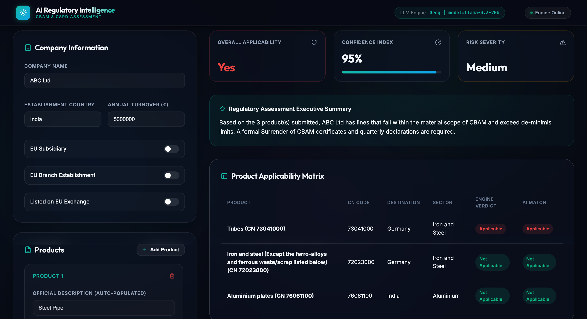

# AI Regulatory Intelligence Platform

> An AI-powered regulatory assessment platform that combines Large
> Language Models with deterministic validation to automate EU
> regulatory compliance assessments.

**Current Module:** Carbon Border Adjustment Mechanism (CBAM)\
**Upcoming Module:** Corporate Sustainability Reporting Directive (CSRD)

------------------------------------------------------------------------

# Overview

The platform performs AI-assisted regulatory assessments for the
European Union Carbon Border Adjustment Mechanism (CBAM).

Unlike a purely rule-based system, the **LLM performs the initial
regulatory reasoning and assessment**, while a **deterministic Python
rule engine validates the AI-generated conclusions against official CBAM
regulatory rules, Annex I product classifications, and EU destination
requirements.**

The platform currently supports both:

-   **Groq API → Llama-3.3-70B**
-   **Ollama → Qwen-3.5**

allowing interchangeable local and cloud inference.

------------------------------------------------------------------------

# Screenshots

### Input Interface


### Output Report


------------------------------------------------------------------------

# Features

-   AI-powered CBAM assessments
-   Deterministic regulatory validation
-   CN Code validation
-   Annex I lookup
-   EU destination verification
-   Executive summaries
-   Consultant recommendations
-   Risk assessment
-   Missing information detection
-   Structured JSON output
-   Interactive HTML Dashboard

------------------------------------------------------------------------

# Architecture

``` text
                    User
                      │
                      ▼
              HTML Dashboard
                      │
                      ▼
                Python Backend
                   (app.py)
                      │
                      ▼
              AI Orchestrator
                      │
        ┌─────────────┴─────────────┐
        ▼                           ▼
 Prompt Builder             Validation Engine
        │                           │
        ▼                           ▲
      Groq API                      │
 Llama-3.3-70B / Ollama:Qwen-3.5    │
        │                           │
        ▼                           │
 AI Regulatory Assessment───────────┘
                      │
                      ▼
              Output Parser
                      │
                      ▼
             Dashboard Results
```

------------------------------------------------------------------------

# Processing Flow

``` text
User Input
     │
     ▼
HTML Dashboard
     │
     ▼
Python Backend
     │
     ▼
Prompt Builder
     │
     ▼
Groq API : Llama-3.3-70B
       /
Ollama : Qwen-3.5
     │
     ▼
AI Regulatory Assessment
     │
     ▼
Deterministic Validation Engine
     ├── Validate CN Code
     ├── Verify Annex I Coverage
     ├── Check EU Destination
     └── Verify Final Assessment
     │
     ▼
Structured JSON
     │
     ▼
Output Parser
     │
     ▼
Dashboard Visualization
```

------------------------------------------------------------------------

# Project Structure

``` text
CBAM-CSRD-Assessment
│
├── agent/
│   ├── llm_client.py
│   ├── ollama_client.py
│   ├── orchestrator.py
│   ├── output_parser.py
│   └── prompt_builder.py
│
├── engine/
│   ├── cbam_engine.py
│   ├── data_loader.py
│   └── models.py
│
├── data/
│   ├── cbam_annex1_cn_codes.csv
│   └── eu_countries.json
│
├── knowledge/
│   ├── cbam.md
│   └── csrd.md
│
├── templates/
│   └── index.html
│
├── app.py
└── requirements.txt
```

------------------------------------------------------------------------

# Technology Stack

  Component            Technology
  -------------------- --------------------------
  Language             Python 3
  AI Provider          Groq / Ollama
  AI Model             Llama-3.3-70B / Qwen-3.5
  Frontend             HTML
  Backend              Python
  Knowledge Base       Markdown
  Regulatory Dataset   CSV
  Country Dataset      JSON
  Rule Engine          Custom Python
  Output               Structured JSON

------------------------------------------------------------------------

# Design Philosophy

The platform follows an **AI-first with deterministic validation**
architecture.

1.  The **LLM performs the regulatory reasoning and generates an
    assessment.**
2.  The **deterministic Python engine validates the AI assessment**
    using official CBAM datasets and regulatory rules.
3.  The validated response is converted into structured JSON.
4.  The dashboard presents the final consultant-style assessment.

This provides:

-   AI-assisted reasoning
-   Deterministic validation
-   Explainability
-   Regulatory transparency
-   Reduced hallucination risk

------------------------------------------------------------------------

# Roadmap

### Completed

-   HTML Dashboard
-   Python Backend
-   Groq Integration
-   Ollama Integration
-   Prompt Builder
-   Output Parser
-   Deterministic Validation Engine
-   Regulatory Knowledge Base
-   Annex I Dataset

### In Progress

-   CSRD Module
-   Unified Regulatory Dashboard
-   Real-world Dataset Validation
-   PDF Report Generation

------------------------------------------------------------------------
